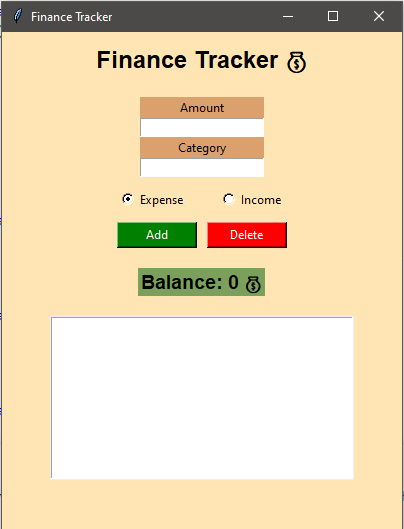

# 💰 Finance Tracker App

A desktop application built using Python and Tkinter to manage personal finances.

## 📌 Overview
This application allows users to track their income and expenses in a simple and interactive way using a graphical interface.

## 🚀 Features
- Add income and expense transactions
- Delete selected transactions
- View all transactions in a list
- Real-time balance calculation
- Simple and clean GUI

## 🧠 Concepts Used
- Object-Oriented Programming (OOP)
  - Encapsulation
  - Inheritance
  - Polymorphism
- GUI Development with Tkinter

## 🛠️ Technologies
- Python
- Tkinter

## 📸 Screenshot

## 🎯 Future Improvements
- Input validation
- Search functionality
- Save data to file
- Better UI design

## 👩‍💻 Author
Tasneem Basem
